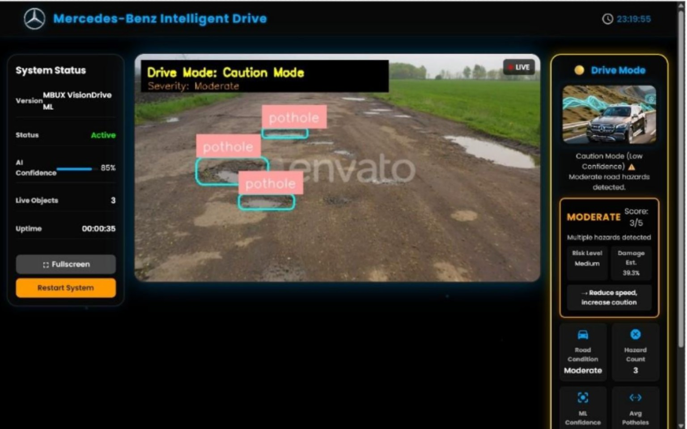
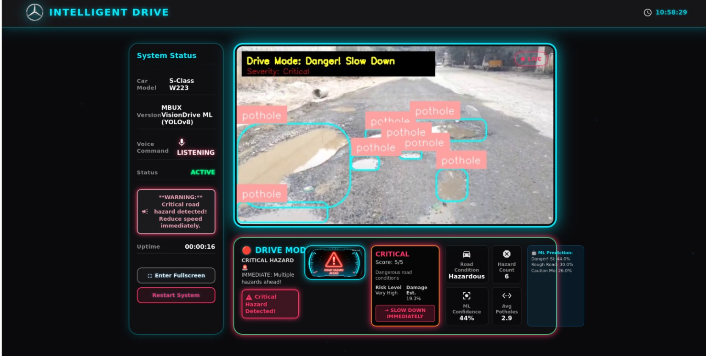
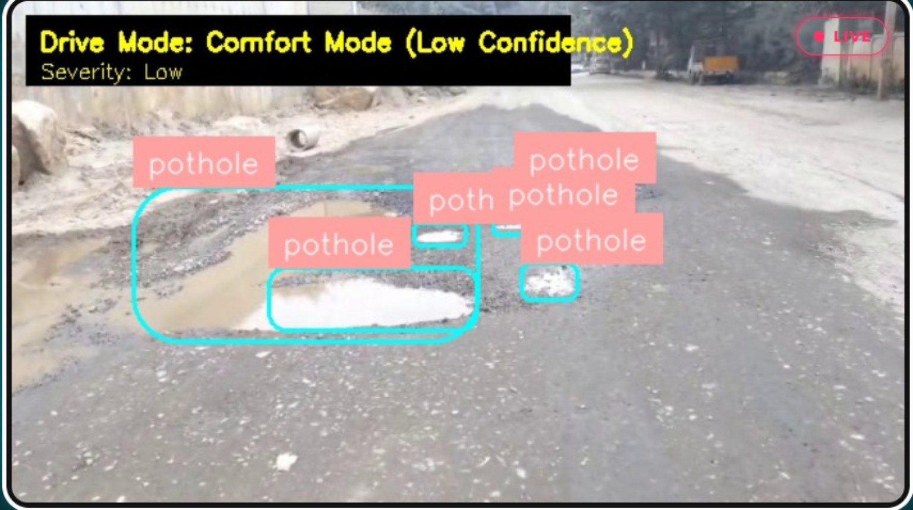
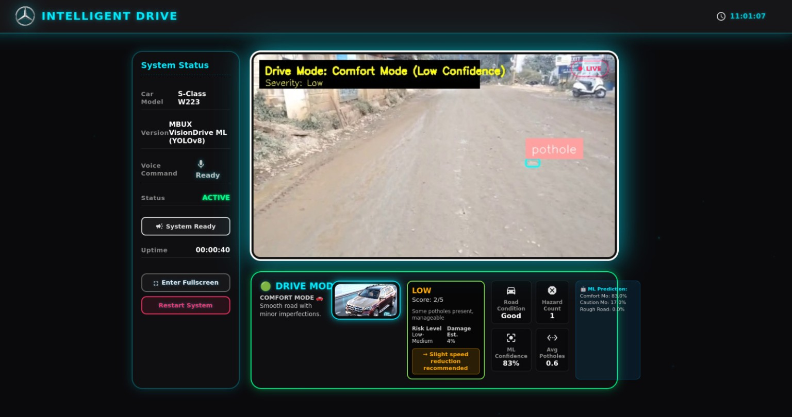
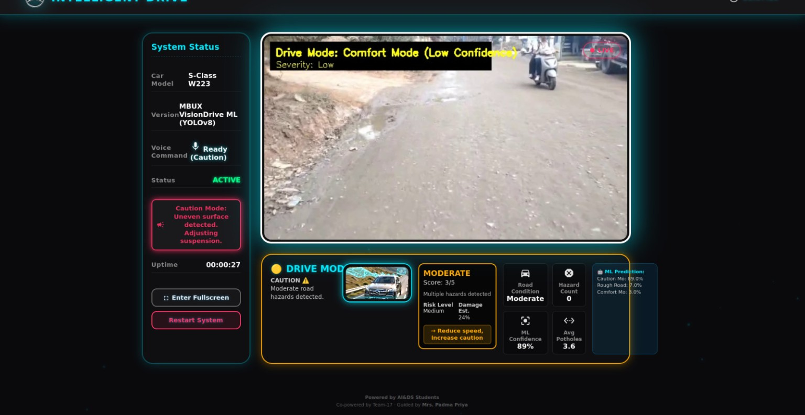

# ADAS Pothole Detection & Adaptive Drive-Mode Recommendation

<p align="center">
  <b>AI-powered road-condition perception and adaptive driving-mode recommendation system</b>
</p>

<p align="center">
  
</p>

## Overview

This project presents an **ADAS-inspired pothole detection and adaptive drive-mode recommendation system**. The system combines computer vision, temporal feature extraction, machine learning, and a web-based dashboard to analyze road conditions from video.

A trained **YOLO object detection model** identifies potholes in incoming frames. Detection statistics are accumulated over a temporal window and converted into features such as average pothole count, variance, rate of change, and recent danger indicators. A **Random Forest classifier** then predicts an appropriate drive mode, while a separate severity layer categorizes the road condition.

The processed video and ML outputs are exposed through a **Flask backend** and visualized through an interactive frontend dashboard.

---

## Dashboard Screenshots

The following screenshots show the prototype interface and detections across different road conditions. Displayed scores and confidence values are example readings from the captured runs, not benchmark accuracy metrics.

### 1. Caution mode — moderate road hazards


### 2. Critical road condition — multiple hazards



### 3. YOLO pothole detection — annotated video frame



### 4. Comfort mode — low road severity



### 5. Moderate road condition — drive-mode telemetry



---

## Key Features

- Real-time pothole detection using YOLO
- Bounding-box visualization using OpenCV and Supervision
- Average detection-confidence calculation
- Temporal feature extraction using a sliding window
- Random Forest based drive-mode recommendation
- Six adaptive drive modes:
  - Comfort+
  - Dynamic
  - Touring
  - Terrain
  - Safety Assist
  - Emergency Hold
- Six road-severity levels:
  - Minimal
  - Very Low
  - Low
  - Moderate
  - High
  - Critical
- MJPEG video streaming through Flask
- JSON API for live ML telemetry
- Dashboard visualization of detection count, confidence, severity and drive mode
- Persistent Random Forest model using Pickle
- Designed for local execution and future edge-device deployment

---

## System Architecture

The architecture is summarized in the **Project Pipeline** diagram below.

### Processing Pipeline

The processing pipeline is shown below.

The complete processing sequence is:

```text
Video / Camera
      ↓
YOLO Object Detection
      ↓
Pothole Detection Statistics
      ↓
Temporal Feature Extraction
      ↓
Random Forest Classification
      ↓
Drive Mode + Severity
      ↓
Flask Backend
      ↓
Web Dashboard
```

---

## Technologies Used

| Component | Technology |
|---|---|
| Programming Language | Python |
| Object Detection | Ultralytics YOLO |
| Computer Vision | OpenCV |
| Detection Annotation | Supervision |
| ML Classifier | Scikit-learn Random Forest |
| Feature Scaling | StandardScaler |
| Backend | Flask |
| Frontend | HTML, CSS, JavaScript |
| Data Processing | NumPy |
| Model Persistence | Pickle |
| Visualization | Browser Dashboard |

---

## Project Structure

```text
ADAS-Pothole-Detection/
│
├── app.py
├── drivemode.py
├── drive_mode_model.pkl
├── best.pt
├── requirements.txt
│
├── templates/
│   └── index.html
│
├── static/
│   └── ...
│
├── video/
│   └── input.mp4
│
├── assets/
│   ├── dashboard_caution.png
│   ├── dashboard_critical.jpg
│   ├── pothole_detection_closeup.jpg
│   ├── dashboard_comfort.jpg
│   └── dashboard_moderate.jpg
│
└── README.md
```

---

# 1. YOLO Pothole Detection

The first stage of the system uses a trained YOLO model to detect potholes from video frames.

Each input frame is resized to a fixed resolution before inference. YOLO returns bounding boxes, class predictions, and confidence scores. The detections are then converted into the Supervision format for visualization.

```python
results = self.model.predict(
    frame,
    conf=0.25,
    iou=0.45,
    verbose=False
)[0]

detections = sv.Detections.from_ultralytics(results)

detection_count = len(detections)

avg_confidence = (
    float(results.boxes.conf.mean() * 100)
    if results.boxes is not None and len(results.boxes) > 0
    else 0.0
)
```

The detection count and average confidence become the primary inputs to the downstream ML decision layer.

---

# 2. Temporal Feature Extraction

Instead of making a drive-mode decision from a single frame, the system maintains a sliding history of recent detections.

The temporal window is used to calculate:

- Average pothole count
- Pothole-count variance
- Rate of change
- Recent danger indicator
- Detection confidence

Example:

```python
avg_potholes = np.mean(self.recent_counts)
variance = np.var(self.recent_counts)

if len(self.recent_counts) >= 2:
    rate = (
        self.recent_counts[-1] - self.recent_counts[0]
    ) / (
        self.recent_timestamps[-1] -
        self.recent_timestamps[0]
    )

recent_danger = int(
    any(c > 6 for c in self.recent_counts[-5:])
)
```

This temporal processing helps the system respond to persistent road conditions rather than relying only on isolated detections.

---

# 3. ML Drive-Mode Recommendation

The extracted features are passed to a Random Forest classifier.

The classifier produces a predicted mode and class probabilities.

```python
features = np.array([[
    avg_potholes,
    confidence,
    rate,
    variance,
    recent_danger
]])

features_scaled = self.scaler.transform(features)

mode_idx = self.model.predict(features_scaled)[0]

probabilities = self.model.predict_proba(
    features_scaled
)[0]

mode = self.modes[mode_idx]
```

The six implemented modes are:

| Mode | General Road Condition |
|---|---|
| Comfort+ | Minimal road disturbance |
| Dynamic | Stable road conditions |
| Touring | Light road imperfections |
| Terrain | Increasing road irregularity |
| Safety Assist | Significant hazards |
| Emergency Hold | Critical road condition |

> **Note:** These are software-level recommendations for the project prototype and do not directly control a real vehicle.

---

# 4. Severity Estimation

A separate severity layer maps the averaged pothole density into six severity categories.

```python
if avg_potholes > 10:
    severity = 5
elif avg_potholes > 7:
    severity = 4
elif avg_potholes > 4:
    severity = 3
elif avg_potholes > 1.5:
    severity = 2
elif avg_potholes > 0.5:
    severity = 1
else:
    severity = 0
```

The resulting categories are:

```text
0 → Minimal
1 → Very Low
2 → Low
3 → Moderate
4 → High
5 → Critical
```

The dashboard uses the severity information to display the current road condition and corresponding visual indicators.

---

# 5. Flask Backend

The Flask application connects the computer-vision and ML layers with the web interface.

The backend provides two primary endpoints.

### `/video_feed`

Streams processed video frames as an MJPEG stream.

```python
@app.route("/video_feed")
def video_feed():
    return Response(
        generate_frames(),
        mimetype="multipart/x-mixed-replace; boundary=frame"
    )
```

### `/detection_count`

Provides the current ML metadata in JSON format.

```python
@app.route("/detection_count")
def detection_stats():
    return jsonify({
        "detections": detection_count,
        "avg_confidence": avg_confidence,
        "drive_mode": drive_mode,
        "ml_mode_data": ml_mode_data
    })
```

---

# 6. Frontend Dashboard

The frontend embeds the processed video and periodically requests the backend JSON endpoint.

```html


<script>
async function updateStats() {
    const response = await fetch("/detection_count");
    const data = await response.json();

    document.getElementById("detCount").innerText =
        data.detections;

    document.getElementById("conf").innerText =
        data.avg_confidence + "%";

    document.getElementById("mode").innerText =
        data.drive_mode;

    document.getElementById("severity").innerText =
        data.ml_mode_data?.severity?.level || "-";
}

setInterval(updateStats, 3000);
updateStats();
</script>
```

This creates a continuous communication loop:

```text
Flask Backend
     ↓
JSON Metadata
     ↓
JavaScript
     ↓
Dashboard
```

---

# 7. Installation

Clone the repository:

```bash
git clone https://github.com/YOUR_USERNAME/ADAS-Pothole-Detection.git
cd ADAS-Pothole-Detection
```

Create a virtual environment:

```bash
python -m venv venv
```

Activate it on Windows:

```bash
venv\Scripts\activate
```

Install dependencies:

```bash
pip install -r requirements.txt
```

---

# 8. Requirements

Example `requirements.txt`:

```text
flask
opencv-python
numpy
scikit-learn
ultralytics
supervision
```

Install with:

```bash
pip install -r requirements.txt
```

---

# 9. Configuration

Update the paths in `app.py`:

```python
PR_MODEL_PATH = r"C:\path\to\best.pt"
PR_VIDEO_PATH = r"C:\path\to\video.mp4"
```

For a GitHub repository, it is recommended to use relative paths instead:

```python
PR_MODEL_PATH = "models/best.pt"
PR_VIDEO_PATH = "video/input.mp4"
```

---

# 10. Running the Project

Start the Flask server:

```bash
python app.py
```

Open the dashboard in a browser:

```text
http://127.0.0.1:5000
```

The system will:

1. Load the YOLO model.
2. Open the input video.
3. Process frames.
4. Detect potholes.
5. Calculate detection statistics.
6. Extract temporal features.
7. Predict the drive mode.
8. Calculate severity.
9. Stream annotated frames.
10. Update the dashboard.

---

# 11. API Output

The `/detection_count` endpoint returns information similar to:

```json
{
    "detections": 3,
    "avg_confidence": 82.45,
    "drive_mode": "Terrain",
    "ml_mode_data": {
        "mode": "Terrain",
        "avg_potholes": 3.2,
        "mode_confidence": 87.4,
        "severity": {
            "level": "Moderate",
            "score": 3,
            "pothole_count": 3,
            "avg_potholes": 3.2,
            "confidence": 82.4
        }
    }
}
```

---

# 12. Model Training

The YOLO model is trained using an annotated pothole dataset.

The trained weights are stored as:

```text
best.pt
```

The model is loaded using:

```python
from ultralytics import YOLO

model = YOLO("best.pt")
```

Inference parameters used by the application include:

```python
conf = 0.25
iou = 0.45
```

These parameters control detection confidence filtering and non-maximum suppression.

---

# 13. Random Forest Model

The drive-mode classifier uses:

```python
RandomForestClassifier(
    n_estimators=100,
    max_depth=10,
    random_state=42
)
```

The input feature vector is:

```text
[
    average_potholes,
    confidence,
    rate_of_change,
    variance,
    recent_danger
]
```

The trained classifier and feature scaler are persisted using Pickle:

```python
pickle.dump({
    "model": self.model,
    "scaler": self.scaler
}, file)
```

This prevents unnecessary retraining every time the application starts.

---

# 14. Testing

The system can be tested at several levels.

### Detection Testing

- Verify pothole bounding boxes.
- Check confidence scores.
- Test frames with zero detections.
- Test multiple potholes in a single frame.

### ML Testing

- Test low pothole density.
- Test increasing pothole density.
- Test sudden increases in detections.
- Verify severity transitions.
- Verify predicted mode and probability output.

### Backend Testing

```text
GET /
GET /video_feed
GET /detection_count
```

### Edge Cases

The implementation handles:

- No detections
- Empty bounding-box results
- Missing model files
- Missing video files
- Low-confidence detections
- Model persistence and reload
- End-of-video conditions

---

# 15. Performance Considerations

Several optimizations are incorporated into the prototype:

- Fixed-resolution frame processing
- YOLO confidence filtering
- IoU-based non-maximum suppression
- Sliding-window temporal processing
- Persistent Random Forest model
- MJPEG streaming
- Optional GPU acceleration through Ultralytics
- Potential frame skipping for low-performance hardware

For deployment on edge devices, additional optimization can include:

```text
ONNX Runtime
TensorRT
FP16 inference
INT8 quantization
Model pruning
Frame skipping
```

---

# 16. Future Improvements

Potential extensions include:

- Real-time camera input instead of prerecorded video
- Pothole depth estimation
- Road-surface segmentation
- GPS-based pothole mapping
- IMU/accelerometer sensor fusion
- Vehicle speed integration
- Weather and illumination awareness
- Edge-device deployment
- ONNX/TensorRT optimization
- Persistent road-condition database
- Interactive pothole heatmap
- Improved drive-mode classifier using real labeled driving data

---

# 17. Important Project Note

This repository demonstrates an **ADAS-inspired research prototype**. The drive-mode and severity outputs are software recommendations based on visual detection and machine-learning inference. They should not be treated as direct commands for controlling a production vehicle.

For safety-critical deployment, the system would require extensive validation, sensor fusion, automotive-grade hardware/software, fail-safe mechanisms, and compliance with applicable automotive standards.

---

## Project Pipeline

```text
                 ┌───────────────────┐
                 │   Video / Camera  │
                 └─────────┬─────────┘
                           ↓
                 ┌───────────────────┐
                 │   YOLO Detector   │
                 └─────────┬─────────┘
                           ↓
                 ┌───────────────────┐
                 │ Pothole Statistics│
                 └─────────┬─────────┘
                           ↓
                 ┌───────────────────┐
                 │ Temporal Features │
                 └─────────┬─────────┘
                           ↓
                 ┌───────────────────┐
                 │ Random Forest ML  │
                 └─────────┬─────────┘
                           ↓
              ┌────────────┴────────────┐
              ↓                         ↓
       ┌─────────────┐           ┌─────────────┐
       │ Drive Mode  │           │  Severity   │
       └──────┬──────┘           └──────┬──────┘
              └────────────┬────────────┘
                           ↓
                 ┌───────────────────┐
                 │  Flask Backend    │
                 └─────────┬─────────┘
                           ↓
                 ┌───────────────────┐
                 │ Web Dashboard     │
                 └───────────────────┘
```

---

## Author

**Harishree S,Chandan S Bhat, K Surya Prakash, Syed Zain**

B.E. Artificial Intelligence & Data Science

### Areas

`Computer Vision` · `Machine Learning` · `Python` · `YOLO` · `ADAS` · `Flask` · `Data Analytics`
